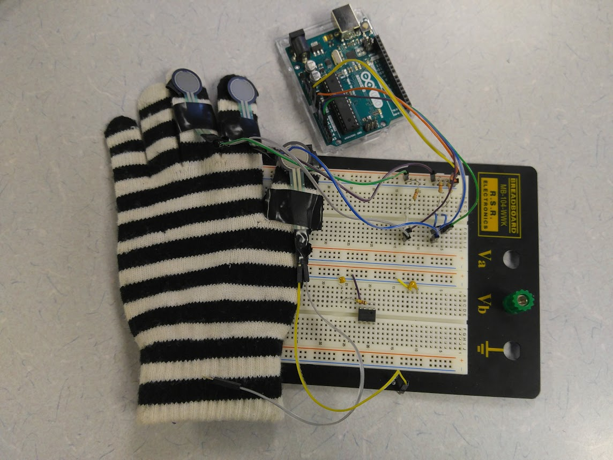
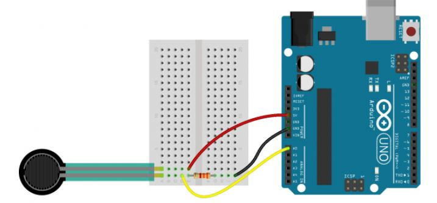

# InteractivityFinalP

https://youtu.be/Hb6t1Ww_d-s

## Hardware Setup
To set up the hardware you will need, the Get a Grip Glove with the sensors attached to it, a breadboard, three 3.3K resistors, and an arduino UNO.



### Schematic for Hardware Setup



1. Hookup one end of the force sensor to the 5V input on the breadboard
2. Hookup the other end of the force sensor to the output of the resistor.
3. Connect the resistor to A0, A1, A2 of the Arduino UNO
4. Connect the other end fo the resistor to ground. 

Your Get a Grip is ready to go!

## Software Setup
The Arduino with pressure sensors attached *must* be connected via USB to the same computer where the UI is being run.
This is because all information is gathered via USB. 

1. Clone this repository.

### Arduino

1. Download the Arduino IDE https://www.arduino.cc/en/Main/Software 
2. Open `forcesensor_ThreeSensors/forcesensor_ThreeSensors.ino` in the Arduino IDE.
3. Connect the Arduino via USB. Upload and run the code on the Arduino (please see documentation at arduino.cc for more help).
4. Open the Serial Monitor. Make note of which port Arduino is running on. It is provided at the top of the Serial Monitor window. (For the image below, it is `COM3`). If you apply force to any of the pressure sensors, you should see three comma separated numbers appear on each line. 

5. Once you've confirmed that the numbers appear when force is applied, close the serial monitor. 

**Warning: Leaving it open will cause error messages that look like `Error Opening COM3: File not found` when Node attempts to access the same port.**


## Node.js
1. Install node.js: https://nodejs.org/
3. Navigate to the directory containing the project and install necessary packages.
`npm install`
4. Update the absolute path in `config.json` with the path to the port Arduino is running on (go to step 4 in the previous section to determine the port name).  
   ```
    {
         "SerialPort": "/abs/path/here"
    }
    ```
5. Run the backend server. `node arduino.js`
6. On the console you should see:
    ```
    C:\Users\Bu Sun\Documents\GitHub\InteractivityFinalP>node arduino.js
    listening on *:3000
    ```
   **Troubleshooting:** 
       - If you see `Error Opening <port>: File not found` then you have the wrong port specified in `config.json`. Go back to step 4. 
       - If you see `Error Opening <port>: Access denied` then you have some other application attempting to listen to the port. The most likely cause is that you have not closed the Serial Monitor in the Arduino IDE.
6. Go to `localhost:3000/index.html` in a browser. 

7. Go to  `Exercises > Writing`

8. The UI will initially look like this:
 
 One pressure is applied to a sensor, that value should update in close to real time.
 
 

