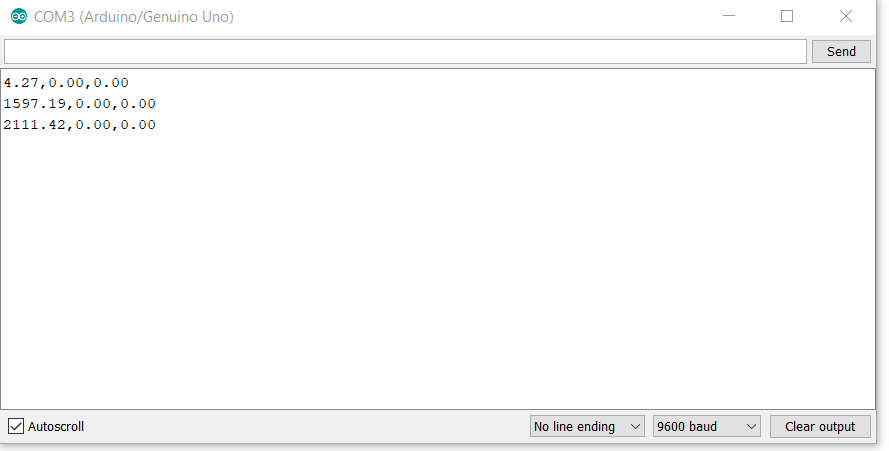
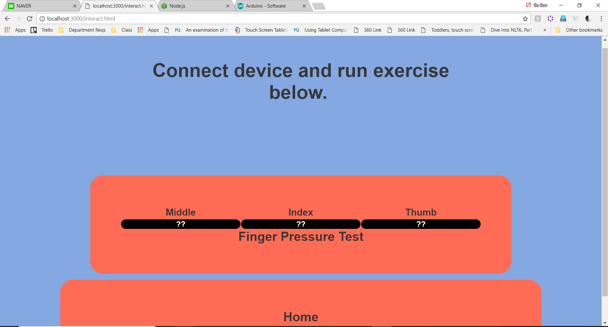
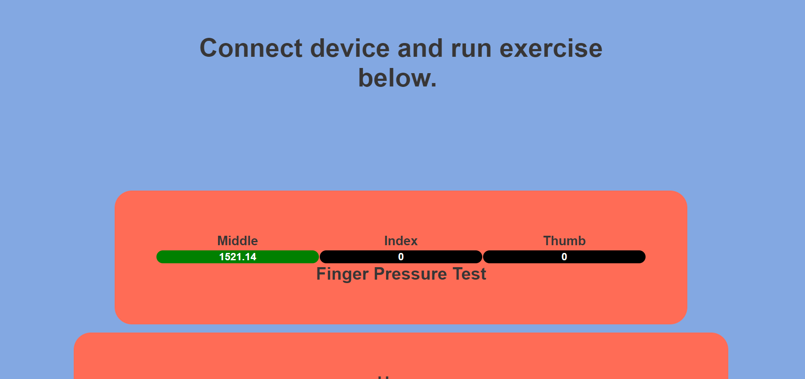

# InteractivityFinalP

A live demo of the UI for our project is available here: https://pianoz.github.io/InteractivityFinalP/

## Software Setup
The Arduino with pressure sensors attached *must* be connected via USB to the same computer where the UI is being run.
This is because all information is gathered via USB. 

1. Clone this repository.

### Arduino

1. Download the Arduino IDE https://www.arduino.cc/en/Main/Software 
2. Open `forcesensor_ThreeSensors/forcesensor_ThreeSensors.ino` in the Arduino IDE.
3. Connect the Arduino via USB. Upload and run the code on the Arduino (please see documentation at arduino.cc for more help).
4. Open the Serial Monitor. If you press on the pressure sensors, you should see three comma separated numbers appear on each line.

5. Once you've confirmed that the numbers appear when force is applied, close the serial monitor. 
Leaving it open will cause issues when Node attempts to access the same port.

## Software Setup (UI)
1. Install node.js: https://nodejs.org/
3. Navigate to the directory containing the project and install necessary packages.
`npm install`
4. Determine which port Arduino is communicating on. This will vary depending on what OS you are using. Afterwards, update the absolute path into `config.json`.  
   ```
    {
         "SerialPort": "/abs/path/here"
    }
    ```
5. Run the backend server. `node arduino.js`
6. Go to `localhost:3000/index.html` in a browser. 
7. Go to  `Exercises > Writing`
8. The UI will initially look like this:
 
 One pressure is applied to a sensor, that value should update in close to real time.
 
 

